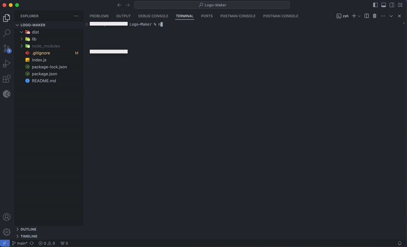

# Logo Maker 

## Description

A node application that will automatically generate a logo as an SVG file. This app features the combination of the inquirer npm module and javascript classes to construct the logos in an asynchronous fashion. 

Each question allows the user to select their logo text, text color, logo shape, and shape color.You will also notice the use of the 3rd-party colors module to add style to the application in the command line.

## Table of Contents

- [Installation](#installation)

- [Usage](#usage)

- [Contributing](#contributing)

- [Tests](#tests)

- [Questions](#questions)

## Installation

This application uses the following node.js dependencies:
- [inquirer@8.2.4](https://www.npmjs.com/package/inquirer) 
- [colors](https://www.npmjs.com/package/colors)
- [jest](https://www.npmjs.com/package/jest)

## Usage

This project can be used to generate quick and easy logos in an svg format. Its current usability is coded to generate either a Circle, Square, or Triangle shaped-logo, but future development can incorporate further shapes.

_ _ 

**Logo generator demo*

## Contributing

N/A

## Tests

The jest npm module was used to test the application.
- Use command:  ***npm test*** 

## Questions

For any additional questions you can reach me at:

- Github: [Justmacn](https://github.com/Justmacn)

- Email: 172618812+justmacn@users.noreply.github.com

